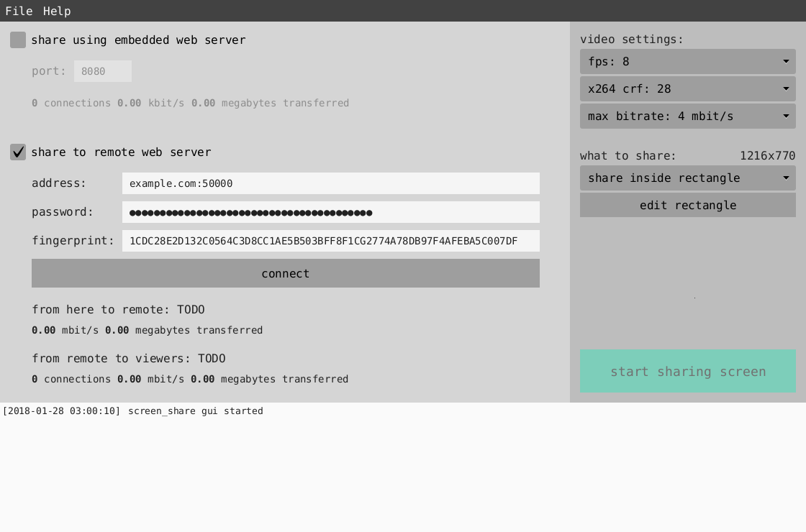

# screen_share
Share your desktop screen to a web based client.
Using an embedded web server or to a remote web server.

The program [screen_share_remote](https://github.com/rootkiwi/screen_share_remote/)
is used for remote web server screen sharing.



## About
It uses JavaCV to access to FFmpeg to capture the screen and libx264 for h264 encoding. Then in the browser
it uses Broadway for javascript h264 decoding. With WebSocket for transport. Jetty is used for the embedded
web server / WebSocket server.

This is video only (no audio) and is not made for any high fps stuff like movies / games etc.
Just for simple desktop sharing. High fps can be resource intensive for the browser (javascript / Broadway).

When using remote sharing a password is used so the remote can authenticate screen_share. And the fingerprint of
the remote TLS certificate needs to be entered in screen_share. So you know you are connecting to the remote you
think you are connecting to, and no man-in-the-middle attack or anything.

## Alpha
I've have not tested it on all platforms / browsers.

I've tested it on Linux x86_64 with Firefox and Chromium.
I've also tested on Windows 7 x86_64 in VirtualBox with Firefox and Chrome.

## Executable jars
Gradle Shadow is used for bundling fat jars, for different platforms.
Right now jars are built for
* Linux x86
* Linux x86_64
* macOS x86_64
* Windows x86
* Windows x86_64

The reason multiple jars are needed is because FFmpeg is bundled, and the jar would be very big if it
contained binaries for all platforms.

Download here: [screen_share/releases/latest](https://github.com/rootkiwi/screen_share/releases/latest)

## How to use
Download a jar file for your platform and start it.

Example:
```
java -jar screen_share-<VERSION>-<PLATFORM>.jar
```

## How to build
Run following to output in `build/libs`
```
./gradlew build_all
```
or
```
./gradlew linux_x86
```
```
./gradlew linux_x86_64
```
```
./gradlew macos_x86_64
```
```
./gradlew win_x86
```
```
./gradlew win_x86_64
```

## Dependencies
Java 8.

For Linux x11grab is used for capturing the screen. No Wayland support, no idea if that's even possible with FFmpeg.
Anyway `libxcb` is needed for x11grab.

Also if you're using OpenJDK you may need to install openjfx as well.

## TODO maybe?
- [ ] Authentication for viewers? Like for example a password required to view.

## License
[GNU General Public License 3 or later](https://www.gnu.org/licenses/gpl-3.0.html)

See LICENSE for more details.

## 3RD Party Dependencies

See also [LICENSES-3RD-PARTY](https://github.com/rootkiwi/screen_share/tree/master/LICENSES-3RD-PARTY).

### Eclipse Jetty

[https://www.eclipse.org/jetty/](https://www.eclipse.org/jetty/)

[Apache License 2.0](https://www.eclipse.org/jetty/licenses.html)


### JavaCV

[https://github.com/bytedeco/javacv/](https://github.com/bytedeco/javacv/)

[Apache License 2.0](https://github.com/bytedeco/javacv/blob/master/LICENSE.txt)


### FFmpeg

[https://ffmpeg.org/](https://ffmpeg.org/)

[GNU General Public License version 2 or later](https://www.ffmpeg.org/legal.html)


### x264

[https://www.videolan.org/developers/x264.html](https://www.videolan.org/developers/x264.html)

[GNU General Public License version 2 or later](https://www.gnu.org/licenses/old-licenses/gpl-2.0.html)


### Broadway

[https://github.com/mbebenita/Broadway/](https://github.com/mbebenita/Broadway/)

[3-clause BSD License](https://github.com/mbebenita/Broadway/blob/master/LICENSE)


### Gradle Shadow

[https://github.com/johnrengelman/shadow/](https://github.com/johnrengelman/shadow/)

[Apache License 2.0](https://github.com/johnrengelman/shadow/blob/master/LICENSE)
